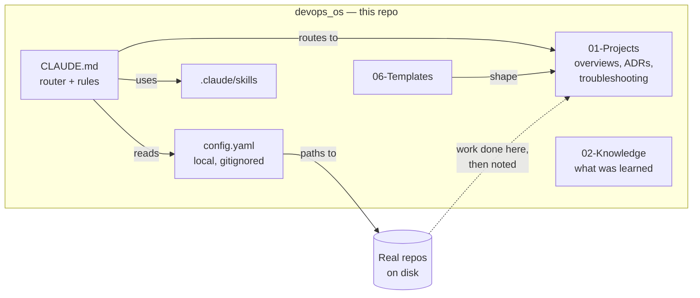

# devops_os

A generic `CLAUDE.md` router template for Terraform/AWS IaC and Azure DevOps
pipeline work with Claude Code — a command center that points at real repos on
disk and tracks decisions, instead of holding any code itself.

This repo is deliberately generic. It holds no real repo names, paths, account
IDs, or project-specific detail — those live in a local `config.yaml`, which is
gitignored and never committed here.

The folder layout below (`00-System/`, `01-Projects/`, `02-Knowledge/`,
`06-Templates/`) is already here after a plain clone — no AI session needed to
bootstrap it. See `setup.md` for what each folder is for and the naming
convention to use for anything created later.

## What it's for

Claude Code starts every session knowing nothing about your repos. This vault gives
it a small, fixed place to look first: which repos exist and where, what was
decided and why, and what has already gone wrong. It is a **command center, not
the code** — Terraform and pipeline work still happens in the real repos, at their
real paths.

## Why use it

What follows comes from how it's designed, not from measurement:

- One entry point (`CLAUDE.md`) instead of re-explaining context at the start of
  every session.
- Decisions (ADRs) and troubleshooting notes are written down once and found again,
  instead of living in a chat that's gone.
- A fixed honesty rule: a plan, a suspicion and a confirmed result are kept apart.
- Vendor skills for Terraform style and AWS IAM come along with the vault.

**Does it save tokens?** Not measured, so no claim is made. Session start is
deliberately small (`CLAUDE.md`, `config.yaml` and a short `Current-Focus.md`), which *should* help, but
reading notes costs tokens too. Treat any saving as unproven until measured.

## How it fits together

## How a session works

1. Open the parent folder in Claude Code. `CLAUDE.md` loads and reads `config.yaml`
   and `00-System/Current-Focus.md`.
2. Name the repo you're working on. If it's new, add it to `config.yaml` and create
   its overview note first (`setup.md`, "Adding a new repo").
3. Claude works in the real repo at its real path, following that repo's own
   `CLAUDE.md` if it has one.
4. When something is actually decided, write an ADR in `01-Projects/<project>/decisions/`.
   When something real is debugged, write a troubleshooting note. Not before.
5. Overwrite `00-System/Current-Focus.md` with the current state if you use it.

## What each folder is

| Path | What it holds |
|---|---|
| `CLAUDE.md` | The router: principle, structure, decisions log, session behavior, security placeholders |
| `setup.md` | Folder layout and naming convention (written for the AI) |
| `config.example.yaml` | Template for `config.yaml`, your real repo paths (gitignored) |
| `00-System/` | `Current-Focus.md` (tiny snapshot, overwritten) and `Retrieval-Questions.md` (what this vault needs to answer) |
| `01-Projects/<name>/` | One folder per real project: repo overviews, `decisions/` (ADRs), `troubleshooting/`. Empty until real work |
| `02-Knowledge/<topic>/` | Things actually learned from real work. Empty until then |
| `06-Templates/` | Templates for repo overviews, ADRs, troubleshooting |
| `.claude/skills/` | `terraform-style-guide`, `aws-iam` (vendored, see `THIRD_PARTY_SKILLS.md`), `azure-devops-cicd` (community) |

Folder numbers 03–05 are unused here, so they can be added later if needed.

## Keeping spend down

Guidance from how Claude Code works, **not measured results** in this vault. Check
your real numbers (`/cost`, or a status line) before relying on any of it.

- A long session re-sends its whole history with every message, so cost grows with
  session length. Start a fresh session for a new task, or run `/compact` earlier.
  A short `Current-Focus.md` is what makes starting fresh cheap.
- Use a smaller model for simple edits and questions.
- Name the repo or file you mean. Letting Claude read whole repos "for context" is
  usually the expensive part.
- Big command outputs and subagents each add their own token use.
- Notes cost tokens to read too. Keep them short, and don't write ones nobody will use.

## Memory

Claude Code's own auto-memory is stored per machine (under `~/.claude/`), not in this
repo, so it doesn't travel with the template and isn't shared between people. What
this repo carries across sessions is `Current-Focus.md`, the ADRs and the notes.

## Limits

- Untested with a team. It's written for one person; sharing it would need changes.
- The notes are only as good as what was written. A wrong note is trusted by the next session.
- Nothing here stops Claude from running Terraform. If a repo's testing is done by
  people, put that rule in that repo's own `CLAUDE.md` or Claude Code permission
  settings.

## Setup

1. Clone this repo into the parent folder that contains (or will contain) the
   repos you work in day to day.
2. Copy `config.example.yaml` to `config.yaml` and fill in real repo paths.
3. Open that parent folder in an editor with Claude Code — `CLAUDE.md` loads
   automatically and reads `config.yaml` for known repos.
4. Fill in the `Security & Data Handling` section of `CLAUDE.md` with your
   actual Claude deployment once confirmed with your organization's policy.

## Files

- `CLAUDE.md` — the router: core principle, structure, known-repos pointer,
  decisions log, session behavior, security placeholders.
- `setup.md` — the folder layout and naming convention, for the AI to follow
  when creating anything new.
- `config.example.yaml` — committed template for the repo list. Copy, don't edit
  in place.
- `docs/index.html` — human-readable page built from the Markdown files by
  `docs/build_docs.py` (stdlib only: `python3 docs/build_docs.py`). Generated, so
  rebuild and commit it after editing any source listed in the script's `MANIFEST`.
  Diagrams load Mermaid from a CDN, so they need internet access to render.
- `.gitignore` — keeps the real `config.yaml` out of git.
- `00-System/`, `01-Projects/`, `02-Knowledge/`, `06-Templates/` — the vault
  skeleton; see `setup.md`.
- `.claude/skills/` — `terraform-style-guide` and `aws-iam` are vendored
  unmodified from HashiCorp's and AWS's own official skill repos (see
  `THIRD_PARTY_SKILLS.md`); `azure-devops-cicd` is community-sourced. All load
  automatically by Claude Code when relevant.

## Keeping this safe to be public

- Never fill in `CLAUDE.md` itself with a real path, org name, or decision detail
  — that belongs in `config.yaml` only, which stays local.
- Never commit `config.yaml`.
- If a real credential, account ID, or proprietary detail ever ends up staged for
  commit here, stop and remove it before pushing.
